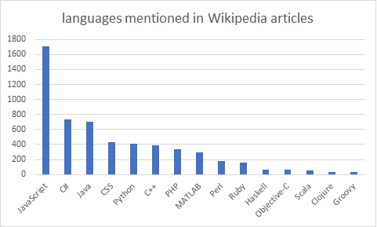

# Introduction 

The aim of this laboratory is to discover the framework spark. This will be done in a practical case as we will use scala and spark to rank programming language over based on their **popularity**. To be more precise we will try and compare different methods to compute the number of time a specific language was mentioned in a series of Wikipedia articles.

In the conclusion of this report we will also compare our computed results with the ones prensented in [this recent article](https://redmonk.com/sogrady/2018/08/10/language-rankings-6-18/) from the RedMonk. RedMonk computed their staticts mostly with Github and stackoverflow so it will be interesting to take that in account while comparing the results.

Although spark offers the ability to be used in a distributed system this laboratory will be implemented with one only node (our laptop). 

The list of wikipedia articles were given with the laboratory instructions. 

# Implementation

As mentionned before the goal of this laboratory is to compare 3 methods of computing the number of time a specific language was mentionned troughout a list of wikipedia articles. This laboratory will be done in scala using the framework spark. Our IDE is Intellij by JetBrain.

A series of Wikipedia articles where given with this laboratory. We will used theses articles to compute our results. With the articles the laboratory also comes with helpful code to make the interaction with the articles easier. We will not describe this given code in our report.   

In part 1 we will implement a naive approach of the language ranking by dividing our problem in two part. First computing the number of occurences of a specific language throughout all articles and then secondly, using our previously build function to rank all languages based on their number of mention.

To assess that our implementation are working correctly this laboratory also comes with a series of units test (multiples for each part). We were also invite, if we wanted too, to add tests we found relevant but we didn't found the need to. 

## Part 1 RankLangs


```scala 
def occurrencesOfLang(lang: String, rdd: RDD[WikipediaArticle]): Int = {
rdd.aggregate(0)((acc, article) =>
    if (wordInArticle(lang, article))
    acc + 1
    else
    acc,
    (x, y) => x + y)
}
```
As displayed here the first part of the code doesn't take much space. It is a rather simplistic approach wich will increment the accumulator
if the condition WordInArticle is true. The WordInArticle function look as follow :

```scala
def wordInArticle(w: String, a: WikipediaArticle): Boolean = {
a.text.split("[ ,!.]+").contains(w)
}
```
This function is really time consuming compared to more simplistic approach (see more about that in the **Performance** chapter). But it is not complicated.
It takes a WikipediaArticle and a language, split the content of the article into a word array and then check if this word array contains the specified language. 


Finally to compute the ranking we call one last function
```scala
def rankLangs(langs: List[String], rdd: RDD[WikipediaArticle]): List[(String, Int)] = {
langs.map((l: String) => (l, occurrencesOfLang(l, rdd))).sortBy(_._2).reverse
}
```

For each language in the list we will compute the number of mention throughout all articles and generate a tuple ```(language, # of mentions of the language) ```. We can then sort all theses tuples based on their second elements and reverse the list to obtain a descending sorted list of language and the number of times they were mentioned in articles. 

We verified our implementation of this part by launching the given unit test. All of them passed. 

**How much does the code take? What is the list of ranked languages?**

The total computation time for this approach was : 
```bash
Processing Part 1: naive ranking took 59018 ms.
```
So around 1 minute witch is really long and should be improved.

It output the following list : 

Language|Number of mention
-|-
JavaScript|1704
C#|731
Java|699
CSS|429
Python|409
C++|384
PHP|333
MATLAB|296
Perl|175
Ruby|160
Haskell|65
Objective-C|61
Scala|53
Clojure|29
Groovy|29


It is good to see that this table is similar in each implemented approach

## Part 2 RankLangsUsingIndex

This approach is divided in two part. We will first implement an inverted index solution witch will be able to return a `RDD` of tuples ``(String, Iterable[WikipediaArticle])`. The idea of inverted index is that for each element (in our case for each language) we will have a list of article mentioning it. It is really interesting because it allow fast full text searches. 

```scala
  def makeIndex(langs: List[String], rdd: RDD[WikipediaArticle]): RDD[(String, Iterable[WikipediaArticle])] = {

     val arts = rdd.flatMap((a: WikipediaArticle) =>
      a.text.split("[ ,!.]+")
        .toSet
        .filter((word: String) =>
          langs.contains(word))
        .map((_, a)))
      .collect()

    sc.parallelize(arts).groupByKey()

  }
```

Once this inverted index build we can use it to compute the ranking. 

```scala
  def rankLangsUsingIndex(index: RDD[(String, Iterable[WikipediaArticle])]): List[(String, Int)] = {
     index.mapValues((it: Iterable[WikipediaArticle]) => it.size).sortBy(-_._2).collect().toList
  }
```
By using `MapValue` we are able to compute quickly the number of articles mentioning a certain language. We then only have to sort the computed list. 

**How much does the code take? What is the list of ranked languages?**

The total computation time for this approach was : 
```bash
Processing Part 2: ranking using inverted index took 11732 ms.
```
Wich is already way faster that in part 1. 

It output the following list : 

Language|Number of mention
-|-
JavaScript|1704
C#|731
Java|699
CSS|429
Python|409
C++|384
PHP|333
MATLAB|296
Perl|175
Ruby|160
Haskell|65
Objective-C|61
Scala|53
Clojure|29
Groovy|29

It is good to see that this table is similar in each implemented approach

**Can you notice a performance improvement over attempt #1? Why?**

There is indeed a significant performance improvement. One of the reasons might be the following :
for the first part, we needed to check if there was a mention of a specific language in an article, so we iterated trough 
each language and then used the function ```occurenceOflang```  over each article for a specific language. 
And it is important to note that to be effective the "check function" has to iterate trough each word of 
a given article's text. 

Knowing all of that it is then pretty straight forward to realize that if we iterate first trough the 
languages and then only trough the words in the article will be less cost efficient in term of list generation
then the opposite. 

## Part 3 RankLangsReduceByKey

Here, we are using the same first technique as the part 2. For each article, we split their text by words and filter them to keep only language words. 

```scala
  def rankLangsReduceByKey(langs: List[String], rdd: RDD[WikipediaArticle]): List[(String, Int)] = {

    rdd.flatMap((a: WikipediaArticle) =>
      a.text.split("[ ,!.]+")
        .toSet
        .filter((word: String) =>
          langs.contains(word))
        .map((_, 1)))
      .reduceByKey(_ + _)
      .sortBy(-_._2)
      .collect()
      .toList

  }
```

The difference from the last part is that after the filter, we map every words that corresponds to a language to a tuple (language, 1). So this way we could use `reduceByKey` that will reduce all the value (1) by key (language) by using the function `_ + _` that do a simple addition. 

This way after the `reduceByKey` we have a list that contains tupples (language, the number of occurence across all the articles). Finally, we sort this list by the number of occurence. 

**How much does the code take? What is the list of ranked languages?**

The total computation time for this approach was :
```bash
Processing Part 3: ranking using reduceByKey took 6381 ms.
```
Wich is by far the fastest approach.

It outputs the following list : 

Language|Number of mention
-|-
JavaScript|1704
C#|731
Java|699
CSS|429
Python|409
C++|384
PHP|333
MATLAB|296
Perl|175
Ruby|160
Haskell|65
Objective-C|61
Scala|53
Clojure|29
Groovy|29

It is good to see that this table is similar in each implemented approach

**Can you notice an improvement in performance compared to measuring both the computation of the index and the computation of the ranking as we did in attempt #2? If so, can you think of a reason?**

Here, the main reason why it's more efficient is that we use the function `reduceByKey` that is specially optimized by Spark to do reductions. Furhtemore, we do the computing in one time compared to the part 2 where it was done in two times. 

In the last part, we looped over all the articles one time, then we loop over all the articles again to group by key. After that we still needed to retrieve the number of articles that mensionned the language. 

Whereas with the 3rd part, we do the loop and the retrieving in one action with the reduction.

## Performances

### Issue with contains

Our first implementation of the laboratory had really poor performances and it was in fact due to the way we implement our condition checking 
for a certain word in an article. The easiest way is to use the method 'contain()' directly on the article text (on the string) **but** it wouldn't allow us to distinct Java an Javascript for exemple. After spending a bit of time trying to use Regexp we finally decided to split our text into words (into a list of string). We could then easily check if our language was inside this list of word. We used the following to split text into words :

```scala
    a.text.split("[ ,!.]+")
```
Meaning that we are "only" splitting our text on space, coma, exclamation point and dot. This is not perfect (has there is other way to split words) but it worked fine for us.

This did worked but we didn't realize how slow it was. Our main issue was that we would split articles into list of words very often.
This was due to the fact that our code looked like the following (simplified) :

```scala

langs.map((l: String) => 
    articles.map((a : WikipediaArticle) =>
        if (a.text.split_into_words().contains(f)...))

```

To get better results we had to change the code in aim to split the article into words less often. 

```scala
    articles.map((a: WikipediaArticle) =>
      a.text.split_into_words()
        .toSet
        .filter((word: String) =>
          langs.contains(word))...

```
In this new approach each article was split into words **one time** instead of **NB_LANG times**

#### Lowercase dilemma

We first tried to compute occurence of language appearing in both lower and higher case, but we finally choose not to. This is due to the fact that adding an highercase/lowercase check add up computation time to the program and it was never specified that we needed it. 


### Final results

```bash
Processing Part 1: naive ranking took 59018 ms.
Processing Part 2: ranking using inverted index took 11732 ms.
Processing Part 3: ranking using reduceByKey took 6381 ms.
```
The plot below will summarize our results :
</br>



# Conclusion

| Rank | RedMonk analysis | Our Analysis |
|------|------------------|--------------|
| 1    | Javascript       | Javascript   |
| 2    | Java             | C#           |
| 3    | Python           | Java         |
| 4    | PHP              | CSS          |
| 5    | C#               | Python       |
| 6    | C++              | C++          |
| 7    | CSS              | PHP          |
| 8    | Ruby             | MATLAB       |
| 9    | C                | Perl         |
| 10   | Objective-C      | Ruby         |
| 11   | Swift            | Haskell      |
| 12   | Scala            | Objective-C  |
| 13   | Shell            | Scala        |
| 14   | Go               | Clojure      |
| 15   | R                | Groovy       |
| 16   | TypeScript       | -            |
| 17   | Powershell       | -            |
| 18   | Perl             | -            |
| 19   | Haskell          | -            |
| 20   | Lua              | -            |

For the most part we can see that there is a slight different between the two approach although we can find some exact similarities (Javascript, C++) and some pretty close call (Java, Python, Objective-C).

Firstly, To understand this difference we may have to understand the difference between the medium used to compute our results. As said before the RedMonk analysis was mostly based on Github and Stackoverflow and, obviously, our studies was based on Wikipedia's articles. It is clear that a developer will find most of the information he is searching on Stackoverflow/Github rather then Wikipedia. It's also more probable to find older informations on Wikipedia as it's main purpose is to work as an encyclopedia. 

Secondly, we can obviously see that our approach used a couple less languages then RedMonk did. It would have been interesting to see how the bottom of the table will have look like if we could have had more information. Our guess is that as languages get less and less mentioned, difference between the two approach would have increase. 

So, we were able to compute an estimation of the usage of common programming languages. We were also able to compare our work with the analysis made by RedMonk and were able to conclude that although our results differ it may have comme from the source of the data itself. We can conclude that by a great margin `Javasrcipt` is today the most popular programming language. 
